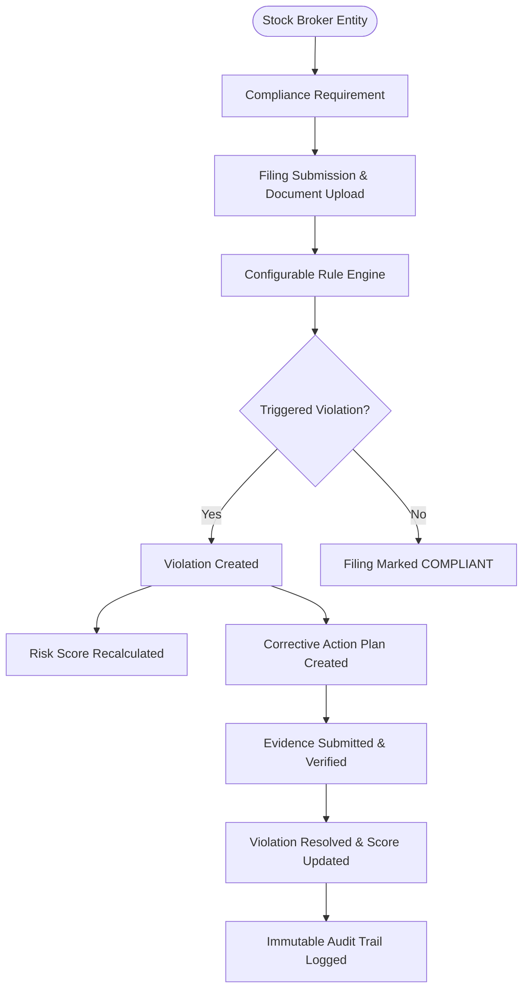

# ReguLens — SEBI Member Compliance Monitoring System
> **Subtitle**: An Academic RegTech Platform for Member Compliance Monitoring, Rule-Based Violation Detection and Risk Assessment

> [!IMPORTANT]
> **Academic RegTech Prototype Disclaimer**:
> This application is an academic RegTech prototype developed for educational purposes. It is not an official SEBI system and does not represent or provide access to SEBI internal systems, databases or regulatory decision-making processes.
> 
> The compliance requirements and risk-scoring model implemented in this application are configurable academic representations and should not be interpreted as official SEBI regulatory methodology.

---

## 1. Executive Summary & Problem Statement

ReguLens is an academic RegTech platform designed for regulated market intermediaries (initially focusing on **Stock Brokers**). It provides an automated, centralized platform allowing compliance officers and administrators to:

1. Manage regulated members and registration validity.
2. Define configurable compliance requirements across cybersecurity, capital adequacy, investor protection, and operational governance.
3. Track compliance filing deadlines.
4. Upload and verify supporting document evidence in a secure vault.
5. Automatically detect non-compliance breaches using a configurable Rule Engine.
6. Manage violations through a structured investigation & CAPA lifecycle.
7. Calculate explainable, deterministic 0–100 risk scores for regulated entities.
8. Provide advisory ML risk predictions using Python FastAPI & Scikit-Learn.
9. Generate executive PDF/CSV compliance reports and maintain an immutable audit trail.

---

## 2. Core System Workflow



---

## 3. Technology Stack

- **Backend**: Java 21 / Spring Boot 3.4.x, Spring Security (JWT), Spring Data JPA, Hibernate, Bean Validation, OpenPDF.
- **Database**: MySQL 8.x / H2 (MySQL Mode), Flyway DDL & Seed Migrations.
- **Frontend**: React 18 SPA, Vite 6, Tailwind CSS, Recharts, Lucide Icons, Axios.
- **ML Microservice**: Python 3.11, FastAPI, Scikit-Learn (RandomForest Advisory Risk Predictor).
- **DevOps**: Docker, Docker Compose, GitHub Actions CI/CD.

---

## 4. Quick Start & Local Execution

### Option A: Direct Local Execution (Zero-Setup)

#### 1. Start Backend (Spring Boot with Flyway + H2 MySQL Mode)
```bash
cd backend
mvn spring-boot:run
```
- REST API Base URL: `http://localhost:8080/api`
- Swagger API Docs: `http://localhost:8080/api/swagger-ui.html`

#### 2. Start Frontend (React Vite SPA)
```bash
cd frontend
npm install
npm run dev
```
- Web Application Portal: `http://localhost:3000`

#### 3. Start Python FastAPI ML Service (Optional Advisory Service)
```bash
cd ml-service
pip install -r requirements.txt
uvicorn app.main:app --reload --port 8000
```
- FastAPI docs available at: `http://localhost:8000/docs`

---

### Option B: Docker Compose

To launch the complete containerized stack (MySQL 8.x, Backend, Frontend, ML Service):
```bash
docker compose up --build
```

---

## 5. Demo Credentials

| Role | Username | Password | Access Scope |
| :--- | :--- | :--- | :--- |
| **System Administrator** | `admin` | `Admin@123` | Full administrative control, rule configuration, member CRUD, audit logs |
| **Compliance Officer** | `officer` | `Officer@123` | Document review, violation investigation, CAPA verification |
| **Stock Broker User** | `member_user` | `Member@123` | ABC Securities portal, document upload, filing status |

---

## 6. Comprehensive 25-Step End-to-End Demo Workflow Walkthrough

1. **Sign In as Admin**: Log in with credentials `admin` / `Admin@123`.
2. **Explore Dashboard**: View real-time database metrics (Total Members, Compliance Rate, Open Violations, High-Risk Members).
3. **Inspect Regulated Entities**: Navigate to `/members` and view the list of 5 synthetic stock brokers (e.g. `ABC Securities`, `Apex Broking`).
4. **Audit Entity Profile**: Click "View Profile" on `ABC Securities` (`DEMO-SB-0001`). Observe its initial Risk Score: **74 / 100 (HIGH)**.
5. **View Compliance Filings**: Navigate to `/compliance`. Observe period records for Cybersecurity Audit and Capital Adequacy returns.
6. **Switch to Member Role**: Log out and log in as `member_user` / `Member@123`.
7. **Upload Filing Evidence**: Navigate to `/documents` and click "Upload Document Proof".
8. **Submit PDF File**: Attach a sample audit certificate for `ABC Securities` against filing `REQ-CYB-01`.
9. **Verify Status Update**: Notice the filing record status automatically transitions from `PENDING` to `SUBMITTED`.
10. **Log in as Compliance Officer**: Log out and sign in as `officer` / `Officer@123`.
11. **Review Document Evidence**: Go to `/documents` and click "Approve" or "Reject" on the submitted filing.
12. **Trigger Overdue Filing**: Observe `REQ-FIN-02` whose due date has passed.
13. **Execute Rule Engine**: Navigate to `/rules` and click "Run Automated Rule Engine".
14. **Inspect Execution Console**: View real-time logs showing `RULE-CMP-001` (Late Filing) and `RULE-CMP-002` (Missing Document) triggering.
15. **Verify Violation Creation**: Navigate to `/violations`. Observe newly generated breach ticket `VIOL-SB-001-RULE-CMP-001-100`.
16. **Assign Officer**: Click "Assign Officer" to allocate the violation to the Senior Compliance Officer.
17. **Recalculate Risk Score**: Navigate to `/risk` or click "Recalculate Risk Score".
18. **Examine Explainable Factors**: Observe the human-readable breakdown explaining why ABC Securities' risk score escalated.
19. **Test Advisory ML Predictor**: View the Python FastAPI advisory prediction card showing model probability and feature importances.
20. **Issue CAPA Plan**: Navigate to `/corrective-actions` and click "Issue CAPA Plan" for the active violation.
21. **Verify CAPA Resolution**: Click "Verify Completion". Observe the violation status transition to `RESOLVED`.
22. **Confirm Risk De-escalation**: Recalculate risk score and verify score reduction upon violation resolution.
23. **Check In-App Notifications**: Navigate to `/notifications` and inspect automated deadline & violation alert logs.
24. **Export Master PDF Report**: Go to `/reports` and click "Download Master PDF Report". Open the generated PDF report.
25. **Inspect Immutable Audit Log**: Navigate to `/audit` (as Admin) to verify every state change was cryptographically logged.

---

## 7. Project Documentation Index

- [System Architecture Document](file:///c:/Users/Amritesh/OneDrive/Desktop/SEBI/docs/architecture.md)
- [Database Schema & ER Model Document](file:///c:/Users/Amritesh/OneDrive/Desktop/SEBI/docs/database.md)
- [REST API Reference Document](file:///c:/Users/Amritesh/OneDrive/Desktop/SEBI/docs/api.md)
- [Security Architecture Document](file:///c:/Users/Amritesh/OneDrive/Desktop/SEBI/docs/security.md)
- [Testing & Quality Assurance Document](file:///c:/Users/Amritesh/OneDrive/Desktop/SEBI/docs/testing.md)
- [Deployment & Cloud Architecture Document](file:///c:/Users/Amritesh/OneDrive/Desktop/SEBI/docs/deployment.md)
- [Academic Risk Engine Model Document](file:///c:/Users/Amritesh/OneDrive/Desktop/SEBI/docs/risk-model.md)
- [Configurable Rule Engine Document](file:///c:/Users/Amritesh/OneDrive/Desktop/SEBI/docs/rule-engine.md)
- [Regulatory Scope & Disclaimer Document](file:///c:/Users/Amritesh/OneDrive/Desktop/SEBI/docs/regulatory-scope.md)

---

## 8. License

Distributed under the MIT License. See [LICENSE](file:///c:/Users/Amritesh/OneDrive/Desktop/SEBI/LICENSE) for more details.
