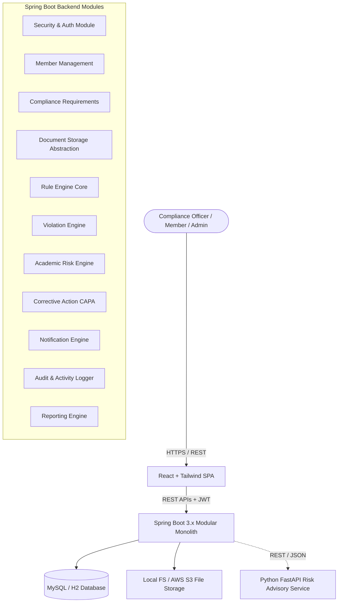

# ReguLens — SEBI Member Compliance Monitoring System
## Architectural & System Design Document (Academic RegTech Prototype)

> [!NOTE]
> **Regulatory Disclaimer**: ReguLens is an Academic RegTech prototype developed strictly for educational and capstone research purposes. It is NOT an official SEBI system, does not connect to internal SEBI networks or databases, and does not provide official regulatory determinations. All regulatory rules and risk models are configurable academic approximations.

---

## 1. System Architecture Overview

ReguLens is designed as a **Modular Monolith** in Java Spring Boot with a separate **React Enterprise Single-Page Application (SPA)** and an optional **Python FastAPI ML Risk Advisory Microservice**.

---

## 2. Relational Database Schema & Entity Design (ER Model)

### Primary Entities & Relationships
1. `users` (id, username, password_hash, email, full_name, status, created_at)
2. `roles` (id, name: ROLE_ADMIN, ROLE_COMPLIANCE_OFFICER, ROLE_MEMBER_USER)
3. `user_roles` (user_id, role_id)
4. `members` (id, member_code, organization_name, registration_number, member_type, registration_date, registration_validity, status, address, city, state, country, contact_email, contact_phone, compliance_officer_id, risk_score, risk_level, created_at, updated_at)
5. `compliance_requirements` (id, requirement_code, title, description, category, frequency, due_date_offset, severity, mandatory, applicable_member_type, effective_from, effective_to, regulatory_reference, active, version)
6. `compliance_records` (id, member_id, requirement_id, period_start, period_end, due_date, submission_date, status, remarks, reviewed_by, reviewed_at, created_at, updated_at)
7. `documents` (id, member_id, compliance_record_id, document_type, original_filename, storage_key, content_type, file_size, checksum_sha256, version, uploaded_by, uploaded_at, expiry_date, status, rejection_reason)
8. `rules` (id, rule_code, rule_name, description, category, condition_expression, action_type, severity_impact, risk_score_delta, active, created_at)
9. `rule_execution_logs` (id, rule_id, compliance_record_id, member_id, triggered, execution_details, executed_at)
10. `violations` (id, violation_code, member_id, compliance_record_id, rule_id, title, description, category, severity, status, detected_at, assigned_officer_id, due_date, resolution_date, resolution_remarks)
11. `corrective_actions` (id, violation_id, action_code, description, root_cause, responsible_person, target_date, completion_date, evidence_document_id, verification_remarks, status, created_at, updated_at)
12. `risk_assessments` (id, member_id, risk_score, risk_level, calculated_at, calculation_version, contributing_factors_json)
13. `notifications` (id, recipient_user_id, type, title, message, severity, related_entity_type, related_entity_id, read_status, created_at)
14. `regulations` (id, title, reference_number, description, effective_date, applicable_member_type, source_url, version, status)
15. `complaints` (id, complaint_code, member_id, category, received_date, description, assigned_officer_id, status, resolution, closed_date)
16. `audit_logs` (id, actor_username, action, entity_type, entity_id, timestamp, old_value_json, new_value_json, ip_address, user_agent)
