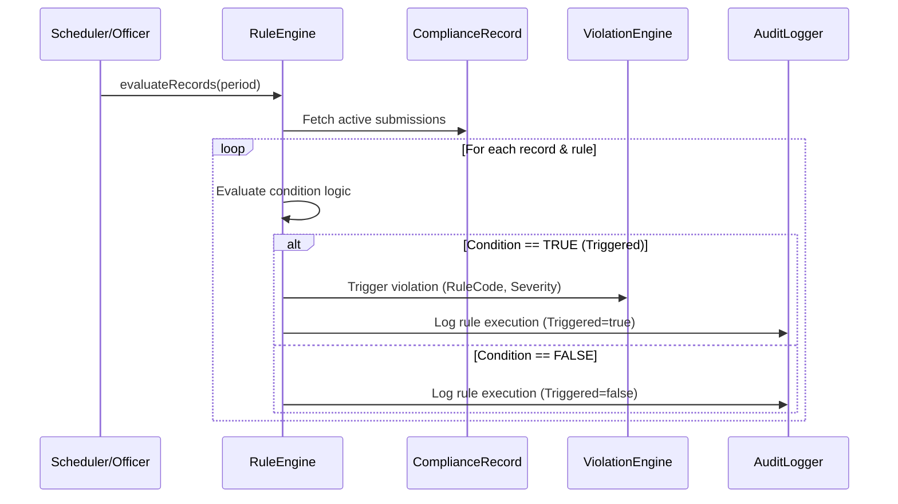

# Configurable Rule Engine Architecture

## Overview

The Rule Engine in the SEBI Member Compliance Monitoring System is decoupled from controller/business logic. It evaluates compliance records and metadata dynamically against configurable rules.

---

## Rule Structure

Each rule comprises:
- `ruleCode`: Unique identification string (e.g., `RULE-CMP-001`)
- `ruleName`: Human readable title
- `category`: Category identifier (`REGULATORY_FILING`, `CYBERSECURITY`, `FINANCIAL`, etc.)
- `conditionExpression`: Evaluated condition string (e.g., `submissionDate > dueDate`, `mandatoryDocumentMissing == true`)
- `actionType`: System action to execute (`CREATE_VIOLATION`, `FLAG_OVERDUE`, `REJECT_SUBMISSION`)
- `severityImpact`: Severity level assigned to resulting violation (`LOW`, `MEDIUM`, `HIGH`, `CRITICAL`)
- `riskScoreDelta`: Score increment added to member risk computation

---

## Rule Execution Lifecycle

---

## Pre-configured Academic Rules

1. **RULE-CMP-001 (Late Submission)**
   - Condition: `submissionDate > dueDate OR (currentDate > dueDate AND status == 'PENDING')`
   - Action: `CREATE_VIOLATION`, Severity: `MEDIUM`
   - Explanation: "Submission was filed after the prescribed due date."

2. **RULE-CMP-002 (Mandatory Document Missing)**
   - Condition: `mandatory == true AND documentCount == 0 AND status == 'SUBMITTED'`
   - Action: `CREATE_VIOLATION`, Severity: `HIGH`
   - Explanation: "Filing submitted without mandatory supporting document attachment."

3. **RULE-CMP-003 (Expired Audit Certificate)**
   - Condition: `documentExpiryDate < currentDate AND documentType == 'CYBER_AUDIT'`
   - Action: `CREATE_VIOLATION`, Severity: `HIGH`
   - Explanation: "Cybersecurity audit certification has passed its expiry date."

4. **RULE-CMP-004 (Repeated Violation Recurrence)**
   - Condition: `sameViolationCountInPastYear >= 2`
   - Action: `CREATE_VIOLATION`, Severity: `CRITICAL`
   - Explanation: "Member triggered 2 or more violations of the same requirement within 12 months."
